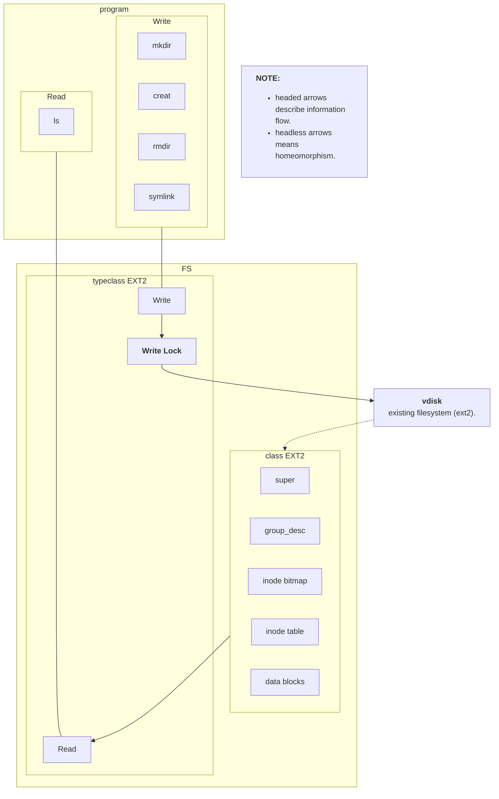

```mermaid
graph
vdisk["<b>vdisk</b><br>existing filesystem (ext2)."]
subgraph FS
	subgraph interface[typeclass EXT2]
		writeLock[<strong>Write Lock</strong>]
		Read
		Write
	end

	subgraph EXT2[class EXT2]
		super[super]
		gd[group_desc]
		imap[inode bitmap]
		inodes[inode table]
		data[data blocks]
	end
end

subgraph program
	subgraph progRead[Read]
		ls
	end
	subgraph progWrite[Write]
		mkdir
		creat
		rmdir
		symlink
	end
end

vdisk -.-> EXT2
progRead --- Read
progWrite --- Write
EXT2 --> Read
Write --> writeLock
writeLock --> vdisk

note[<div align=left><strong>NOTE:</strong><br><ul><li>headed arrows describe information flow.<li>headless arrows means homeomorphism.</li></ul></div>]
```
