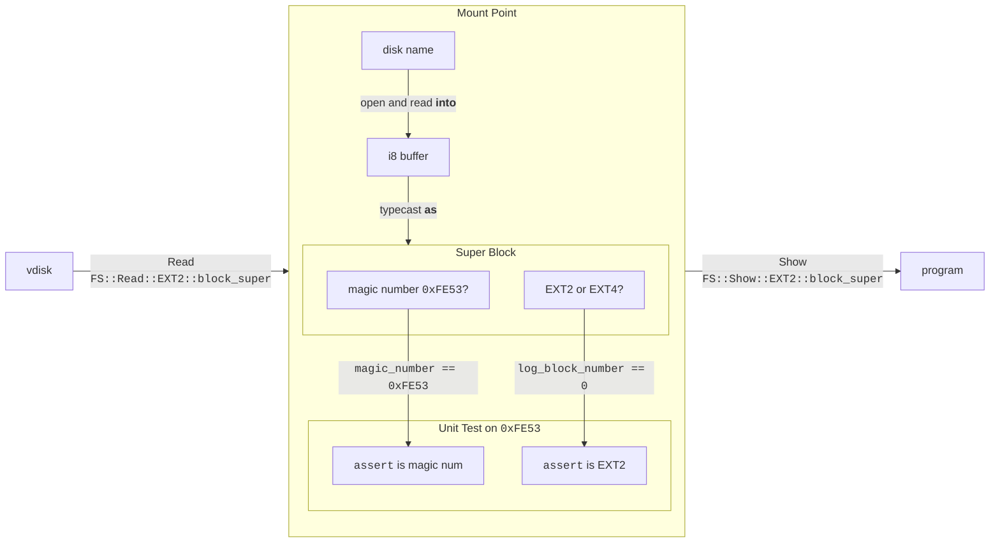

This document lays out the strategy for building up unit tests for the project. Testing should be deeply integrated into the development process. 

In general, a particular product needs to be tested on three aspects: functionality, integrity and viability. These three aspects map to unit tests, integration tests and E2E tests, in that order. For this shell program, unit tests will be a very common recurrence. Eventually, once we have gotten to the software packaging phase, we will consider how to conduct integration test.

For now, we will focus on unit testing within the scope of the first phase of development.

At the moment, I have created a working interface *with* the vdisk. This interface is the `FS::EXT2` struct. How do I test this interface? I can start with checking for the magic number.

We need to test the attributes of the super block right away, because eventually we will come back to update other attributes such as `free_block_count` and `free_inode_count` every time we modify data on disk. At that point, it will be a lot more work to set up the test suite from scratch.

By design, `FS::EXT2` is a struct. Functions that interact with it are decoupled elsewhere. This has the benefit of letting us inject unit tests into the appropriate step in the chain. From the graph we can see that right after reading the super block, we can retrieve and test the various attributes. Hence, the `assert` tests should accomplish the same thing as `FS::Show` but automated.

- The form of the test suite shall be as follow:
    1. Test Setup
        - mock the vdisk struct
        - we cannot test `open` and `read` because they are non-deterministic.
    2. Test
        - evaluate the magic number
        - evaluate the log block number
    3. Test Cleanup
        - automatically done when the struct goes out of scope thanks to the destructor. 

